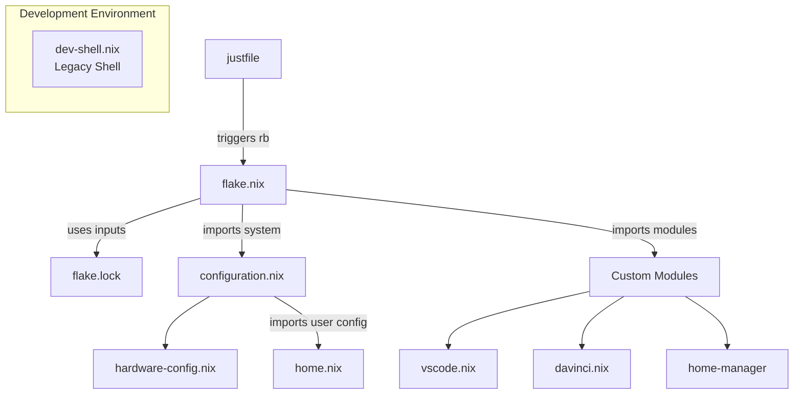

# NixOS Configuration Repository

This document provides an overview and maintenance guide for the NixOS configuration repository located at `/etc/nixos`. It utilizes Nix Flakes for reproducibility and Home Manager for user-specific dotfile management.

## Overall Structure

This repository employs a modern NixOS setup combining several components:

* **Nix Flakes:** The core mechanism (`flake.nix`, `flake.lock`). Flakes define dependencies (inputs) and outputs (like the NixOS system configuration and development shells), ensuring reproducible builds by pinning exact dependency versions.
* **NixOS System Configuration:** Defines the global system settings, services, hardware configuration, and system-wide packages (`configuration.nix`, `hardware-configuration.nix`).
* **Home Manager:** Manages user-specific configurations ("dotfiles"), packages, and services declaratively (`home.nix`). It's integrated into the NixOS system build via the flake.
* **Custom NixOS Modules:** Separate `.nix` files defining configurations for specific applications or settings (`vscode.nix`, `davinci.nix`). These are imported into the main system configuration.
* **Legacy Development Shell:** A separate `dev-shell.nix` file defines a development environment using the older `nix-shell` (or `pkgs.mkShell`) mechanism. This is not currently integrated with the flake's `devShells` output.
* **Task Runner:** Uses `just` (`justfile`) to provide convenient aliases for common administrative tasks like rebuilding the system.
* **Supporting Files:** Includes standard Git files (`.gitignore`, `.gitattributes`), linter configs (`.statix.toml`), package definitions (`supabase-package.nix`), and other helper files.

## System Architecture



## Role of Each Key File

### `flake.nix`

* **Role:** The central definition file for the Nix Flake. Dictates structure, inputs, and outputs.
* **Defines:**
    * `inputs`: External dependencies (e.g., `nixpkgs`, `home-manager`) with pinned versions.
    * `outputs`: What the flake provides:
        * `nixosConfigurations.nixos`: The main NixOS system build definition, importing necessary modules.
        * `devShells`: Flake-based development environments (`impure`, `uv2nix`), separate from `dev-shell.nix`.
        * Other standard outputs (`packages`, `checks`, `formatter`).

### `flake.lock`

* **Role:** Auto-generated file pinning exact input revisions.
* **Ensures:** Reproducibility across builds. Update with `nix flake update`.

### `configuration.nix`

* **Role:** Core NixOS system configuration, imported by `flake.nix`.
* **Defines:** Hostname, networking, Nix settings (unfree, experimental features, Cachix), system packages, services (OpenVPN, SSHd, Docker, Pipewire), graphical session (Xorg, GDM, Gnome), hardware settings (Nvidia), user accounts, fonts, state version.
* **Integrates:** Home Manager via `import ./home.nix`.

### `hardware-configuration.nix`

* **Role:** Hardware-specific settings (filesystems, kernel modules) generated during installation. Usually not edited manually.

### `home.nix`

* **Role:** Home Manager configuration for the user `h0ffmann`.
* **Defines:** User packages, shell settings (Bash), Git config, Gnome/dconf settings.

### `dev-shell.nix`

* **Role:** Defines a legacy development environment using `pkgs.mkShell`. Invoked via `nix-shell dev-shell.nix` (or the `devshell` alias).
* **Provides:** A wide range of development tools and libraries. Runs setup commands via `shellHook`.
* **Isolation:** Uses its own `nixpkgs` instance, independent of the flake configuration.

### `justfile`

* **Role:** Defines command aliases using the `just` task runner.
* **Defines:** `rb` (rebuild system), `fmt`, `gc`, `audio`, `dump`, etc.

## Development Environment and Package Integration

The repository provides a comprehensive development environment through `flake.nix` with these key features:

1. **Extensive Package Collection:** Programming languages (Rust, Python, Node.js, Go, Scala), development tools, utilities and libraries.

2. **Library Linking:** The environment sets up a complete `LD_LIBRARY_PATH` with all necessary system libraries for GUI applications, graphics acceleration, audio, and more complex software requirements.

3. **Binary Package Integration:**
   - **AppImage Support:** Includes `appimage-run` for running AppImage files like WaveTerm
   - **Steam Run:** Uses `steam-run` as an FHS wrapper to run non-NixOS-packaged binaries
   - **Custom Wrappers:** Creates shell scripts to facilitate launching external applications

4. **Environment Configuration:** Provides a rich development environment with:
   - Python virtual environment setup
   - Docker/Podman detection and configuration
   - Node.js package management
   - Go workspace configuration
   - Rust toolchain integration
   - Cloud SDK setup

## System Management

### Rebuilding NixOS

To rebuild the system with the latest configuration:

```bash
# From the repository root
just rb

# Or manually
sudo nixos-rebuild switch --flake "$(pwd)"
```

### NixOS Rollback Instructions

#### Viewing System Generations

```bash
# Using justfile
just history

# Or manually
nix profile history --profile /nix/var/nix/profiles/system
```

#### Rolling Back to a Previous Generation

For NixOS with flakes, use these methods:

1. **Switch to a specific generation:**
   ```bash
   sudo nix-env --profile /nix/var/nix/profiles/system --switch-generation NUMBER
   sudo /nix/var/nix/profiles/system/bin/switch-to-configuration switch
   ```

2. **Boot to a previous generation:**
   - Reboot your system
   - Select the desired generation from the boot menu
   - Run `sudo nixos-rebuild switch` after booting to make it permanent

3. **Rollback to previous generation:**
   ```bash
   sudo nix profile rollback --profile /nix/var/nix/profiles/system
   sudo /nix/var/nix/profiles/system/bin/switch-to-configuration switch
   ```

## Maintaining `dev-shell.nix`

This file uses the older `mkShell` approach. Maintenance tips:

* **Packages (`packages` list):**
    * Add/remove packages using `pkgs.<attributeName>`.
    * Manage project-specific Python dependencies via `uv`/`poetry` inside the shell, rather than globally in `(python312.withPackages ...)`.
* **Environment Variables (`env` block):**
    * Set static variables needed before the `shellHook` runs.
* **Shell Hook (`shellHook` script):**
    * Runs on shell entry. Use for dynamic setup, checks, status messages. Keep it lean.
    * Ensure commands exist in `packages`. Prioritize Nix-provided tools in `PATH`.
* **External Binaries:**
    * **Prefer Nix Packages:** Use `pkgs.rustc`, `pkgs.electron`, etc., instead of tools like `rustup` or npm's Electron download.
    * **Use Wrappers:** If an incompatible binary must be run (e.g., from `npm install`), include `pkgs.steam-run` in `packages` and run the command as `steam-run <command>`.
* **`LD_LIBRARY_PATH`:**
    * May be necessary for complex GUI apps if not using wrappers. Try simplifying if possible, but it's often required.
* **Consider Flake `devShells`:** For better consistency, migrate this environment to `flake.nix -> outputs.devShells`. Enter using `nix develop`.

## Fixing `devshell: command not found`

The error `devshell: command not found` means `devshell` is not a command recognized by your regular shell. It needs to be defined as a shell alias or function.

**How to Define the Alias:**

1.  **Identify your shell:** Run `echo $SHELL`.
2.  **Edit your shell's configuration file:**
    * Bash: `~/.bashrc`
    * Zsh: `~/.zshrc`
    * Fish: `~/.config/fish/config.fish`
3.  **Add the alias definition:**
    * For Bash/Zsh:
        ```bash
        # Alias to enter the nix-shell defined in dev-shell.nix in the current directory
        alias devshell='nix-shell dev-shell.nix'

        # --- OR --- (If you migrate to flake devShells.default)
        # alias devshell='nix develop'
        ```
    * For Fish:
        ```fish
        # Alias to enter the nix-shell defined in dev-shell.nix in the current directory
        alias devshell 'nix-shell dev-shell.nix'

        # --- OR --- (If you migrate to flake devShells.default)
        # alias devshell 'nix develop'
        ```
4.  **Apply the changes:** Either restart your terminal or `source` the config file (e.g., `source ~/.bashrc`).

Now, typing `devshell` in the `/etc/nixos` directory should launch the environment defined in `dev-shell.nix`.