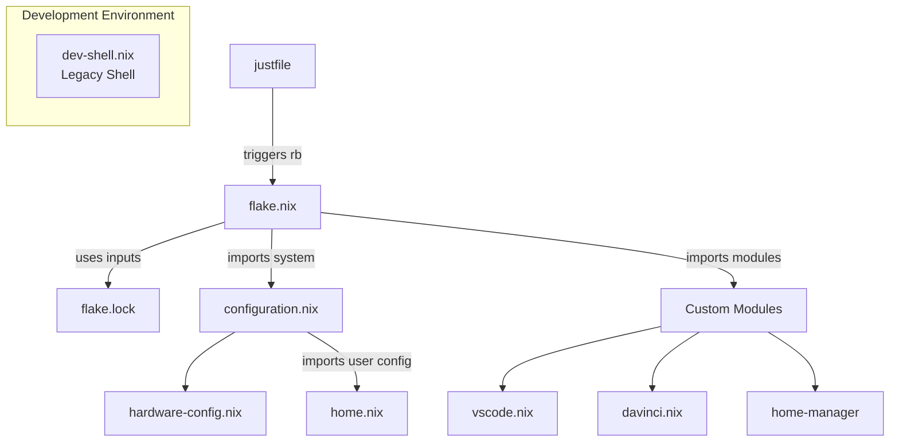

This file is a merged representation of a subset of the codebase, containing files not matching ignore patterns, combined into a single document by Repomix.
The content has been processed where comments have been removed, empty lines have been removed, content has been compressed (code blocks are separated by ⋮---- delimiter).

# File Summary

## Purpose
This file contains a packed representation of the entire repository's contents.
It is designed to be easily consumable by AI systems for analysis, code review,
or other automated processes.

## File Format
The content is organized as follows:
1. This summary section
2. Repository information
3. Directory structure
4. Repository files (if enabled)
4. Multiple file entries, each consisting of:
  a. A header with the file path (## File: path/to/file)
  b. The full contents of the file in a code block

## Usage Guidelines
- This file should be treated as read-only. Any changes should be made to the
  original repository files, not this packed version.
- When processing this file, use the file path to distinguish
  between different files in the repository.
- Be aware that this file may contain sensitive information. Handle it with
  the same level of security as you would the original repository.

- Pay special attention to the Repository Instruction. These contain important context and guidelines specific to this project.

## Notes
- Some files may have been excluded based on .gitignore rules and Repomix's configuration
- Binary files are not included in this packed representation. Please refer to the Repository Structure section for a complete list of file paths, including binary files
- Files matching these patterns are excluded: .venv-py312/, .vscode/, target/
- Files matching patterns in .gitignore are excluded
- Files matching default ignore patterns are excluded
- Code comments have been removed from supported file types
- Empty lines have been removed from all files
- Content has been compressed - code blocks are separated by ⋮---- delimiter
- Files are sorted by Git change count (files with more changes are at the bottom)

## Additional Info

# Directory Structure
```
cachix/
  cuda-maintainers.nix
  nix-community.nix
.env.template
.gitattributes
.gitignore
.statix.toml
cachix.nix
code-quality-instruction.md
code-quality.config.json
configuration.nix
davinci.nix
dev-shell.nix
dev-shell.nix.backup
flake.lock
flake.nix
hardware-configuration.nix
home.nix
justfile
README.md
repomix-instruction.md
repomix.config.json
supabase-package.nix
vscode.nix
```

# Files

## File: code-quality-instruction.md
````markdown
Assess code quality and suggest improvements:
1. Review naming conventions
2. Check code organization
3. Evaluate error handling
4. Review commenting practices

Provide specific examples of good and problematic patterns.
````

## File: code-quality.config.json
````json
{
  "output": {
    "filePath": "nixos.md",
    "style": "markdown",
    "compress": true,
    "fileSummary": true,
    "directoryStructure": true,
    "removeComments": true,
    "removeEmptyLines": true,
    "topFilesLength": 15,
    "showLineNumbers": false,
    "includeEmptyDirectories": true,
    "instructionFilePath": "code-quality-instruction.md",
    "git": {
      "sortByChanges": true,
      "sortByChangesMaxCommits": 100
    }
  },
  "include": [],
  "ignore": {
    "useGitignore": true,
    "useDefaultPatterns": true,
    "customPatterns": [
      ".venv-py312/",
      ".vscode/",
      "target/"
    ]
  },
  "security": {
    "checkSensitiveInfo": true
  },
  "excludeFiles": []
}
````

## File: cachix/cuda-maintainers.nix
````
{
  nix = {
    settings = {
      substituters = [
        "https://cuda-maintainers.cachix.org"
      ];
      trusted-public-keys = [
        "cuda-maintainers.cachix.org-1:0dq3bujKpuEPMCX6U4WylrUDZ9JyUG0VpVZa7CNfq5E="
      ];
    };
  };
}
````

## File: cachix/nix-community.nix
````
{
  nix = {
    settings = {
      substituters = [
        "https://nix-community.cachix.org"
      ];
      trusted-public-keys = [
        "nix-community.cachix.org-1:mB9FSh9qf2dCimDSUo8Zy7bkq5CX+/rkCWyvRCYg3Fs="
      ];
    };
  };
}
````

## File: .env.template
````
# Brave Search API Key
BRAVE_API_KEY=your_brave_api_key_here
````

## File: .gitattributes
````
*.AppImage filter=lfs diff=lfs merge=lfs -text
````

## File: .statix.toml
````toml
ignored = []

[rules]
repeated-keys = "off"
````

## File: cachix.nix
````
# WARN: this file will get overwritten by $ cachix use <name>
{ pkgs, lib, ... }:

let
  folder = ./cachix;
  toImport = name: value: folder + ("/" + name);
  filterCaches = key: value: value == "regular" && lib.hasSuffix ".nix" key;
  imports = lib.mapAttrsToList toImport (lib.filterAttrs filterCaches (builtins.readDir folder));
in {
  inherit imports;
  nix.settings.substituters = ["https://cache.nixos.org/"];
}
````

## File: davinci.nix
````
{ config, lib, pkgs, ... }:

with lib;
let
  cfg = config.programs.davinci-resolve-studio;
in
{
  options.programs.davinci-resolve-studio = {
    enable = mkEnableOption "DaVinci Resolve Studio";
    package = mkOption {
      type = types.package;
      default = pkgs.davinci-resolve-studio;
      description = "DaVinci Resolve Studio package to use.";
    };
  };

  config = mkIf cfg.enable {
    environment.systemPackages = [ cfg.package ];

    # Optional: Add any specific configurations needed
    environment.sessionVariables = {
      RESOLVE_SCRIPT_API = "${cfg.package}/libs/Fusion/fusionscript.so";
      RESOLVE_SCRIPT_LIB = "${cfg.package}/libs/Fusion/";
      RESOLVE_LIBRARY_PATH = "${cfg.package}/libs/Fusion/";
    };
  };
}
````

## File: dev-shell.nix.backup
````
{ pkgs ? import <nixpkgs> {
    config = {
      allowUnfree = true;
      allowBroken = true;
      permittedInsecurePackages = [
        # Add any specific insecure packages if needed
      ];
    };
  }
}:

let
  x = 10;
in
pkgs.mkShell {
  buildInputs = with pkgs; [
    # Network utils
    speedtest-cli
    dig

    # Scala environment
    scala-cli

    # Python environment
    python312
    python312Packages.pip
    python312Packages.setuptools
    python312Packages.wheel
    python312Packages.virtualenv
    uv
    python312Packages.conda
    poetry

    # Rust environment (latest stable)
    rustc
    cargo
    rustfmt
    clippy
    rust-analyzer

    # WebAssembly support
    wasm-pack
    llvmPackages.lld

    # Dependencies for Rust development (Ubuntu/Debian equivalents)
    pkg-config # pkg-config
    openssl # libssl-dev
    openssl.dev
    postgresql # libpq-dev
    postgresql.lib
    libclang # libclang-dev
    clang
    gcc # build-essential equivalent
    gnumake
    binutils

    # Docker and container tools
    docker
    docker-compose
    docker-client

    # Just command runner (for Rust project tasks)
    just

    # Supabase tools
    supabase-cli
    postgresql
    jq

    # Node.js (Latest LTS version)
    nodejs_22
    # For latest stable, uncomment the line below and comment out the LTS version above
    # nodejs # Latest stable

    # Package managers
    nodePackages.npm
    yarn

    # Node.js packages

    # Development tools
    busybox
    lsof
    git

    # Go environment and security tools
    go

    # Dependencies for Puppeteer and Playwright (browser automation)
    chromium

    # X11 and related libraries
    xorg.libX11
    xorg.libXcomposite
    xorg.libXcursor
    xorg.libXdamage
    xorg.libXext
    xorg.libXi
    xorg.libXrandr
    xorg.libXScrnSaver
    xorg.libXtst
    xorg.libxcb
    xorg.libXfixes

    # GTK and related libraries
    pango
    cairo
    cups.lib
    dbus
    expat
    fontconfig
    freetype
    libpng
    nspr
    nss
    atk
    gdk-pixbuf
    gtk3
    alsa-lib

    # Additional missing libraries
    glib
    at-spi2-atk
    at-spi2-core
    libxkbcommon
    udev
    mesa
    mesa.drivers

    # For file watchers
    inotify-tools

    # network
    nmap

    # Terraform and related tools
    terraform
    terraform-ls
    tflint
    terraform-docs
    terragrunt

    # Infrastructure as Code tools
    pulumi

    # Docker/container linting
    hadolint

    # Google Cloud Platform tools
    google-cloud-sdk

    # Add these dependencies
    stdenv.cc.cc.lib
    libGL
  ];

  shellHook = ''
    # Allow unfree packages
    export NIX_ALLOW_UNFREE=1
    
    export LD_LIBRARY_PATH=${pkgs.stdenv.cc.cc.lib}/lib:$LD_LIBRARY_PATH

    # Configure Docker environment
    if command -v docker &>/dev/null; then
      if ! docker info &>/dev/null; then
        echo "Setting up Docker environment..."
        
        if systemctl is-active docker.service &>/dev/null; then
          echo "Docker service is active"
        else
          echo "Docker service is not active. You may need to start it manually with:"
          echo "sudo systemctl start docker.service"
          echo "sudo systemctl enable docker.service"
        fi
        
        if ! groups | grep -q docker; then
          echo "Warning: Current user is not in the docker group."
          echo "You may need to run the following command and log out/in again:"
          echo "sudo usermod -aG docker $USER"
        fi
      else
        echo "Docker is ready to use!"
      fi
    else
      if command -v podman &>/dev/null; then
        echo "Docker not available, using Podman instead"
        if [ ! -e $HOME/.local/bin/docker ]; then
          mkdir -p $HOME/.local/bin
          ln -sf $(which podman) $HOME/.local/bin/docker
        fi
        export PATH=$HOME/.local/bin:$PATH
      else
        echo "Neither Docker nor Podman are available."
      fi
    fi
    
    # Python environment setup
    echo "Python development environment ready!"
    echo "Python version: $(python --version)"
    echo "uv version: $(uv --version)"
    echo "conda version: $(conda --version)"
    
    if command -v poetry &> /dev/null; then
      echo "Poetry version: $(poetry --version)"
    else
      echo "Warning: Poetry not found."
    fi
    
    VENV_DIR=".venv"
    if [ ! -d "$VENV_DIR" ]; then
      echo "Creating Python virtual environment in $VENV_DIR..."
      python -m venv $VENV_DIR
      echo "Virtual environment created"
    fi
    
    echo "To activate the Python virtual environment, run: source $VENV_DIR/bin/activate"
    
    if command -v conda &> /dev/null; then
      eval "$(conda shell.bash hook)"
      echo "To create a new conda environment: conda create -n myenv python=3.12"
      echo "To activate a conda environment: conda activate myenv"
    else
      echo "Warning: conda not found."
    fi
    
    # Rust environment setup
    echo "Rust development environment ready!"
    echo "Rust version: $(rustc --version)"
    echo "Cargo version: $(cargo --version)"
    
    # Go environment setup
    echo "Go development environment ready!"
    echo "Go version: $(go version)"
    
    export GOPATH="$PWD/.go"
    export GOBIN="$GOPATH/bin"
    export PATH="$GOBIN:$PATH"
    mkdir -p "$GOBIN"
    
    export npm_config_prefix=$HOME/.npm-global
    mkdir -p $HOME/.npm-global/bin
    export PATH=$HOME/.npm-global/bin:$PATH
    
    export PUPPETEER_SKIP_CHROMIUM_DOWNLOAD=1
    export PUPPETEER_EXECUTABLE_PATH=${pkgs.chromium}/bin/chromium

    export LD_LIBRARY_PATH=${pkgs.lib.makeLibraryPath [
      pkgs.glib
      pkgs.nss
      pkgs.nspr
      pkgs.dbus
      pkgs.atk
      pkgs.at-spi2-atk
      pkgs.cups.lib
      pkgs.expat
      pkgs.xorg.libX11
      pkgs.xorg.libXcomposite
      pkgs.xorg.libXdamage
      pkgs.xorg.libXext
      pkgs.xorg.libXfixes
      pkgs.xorg.libXrandr
      pkgs.mesa
      pkgs.xorg.libxcb
      pkgs.libxkbcommon
      pkgs.pango
      pkgs.cairo
      pkgs.udev
      pkgs.alsa-lib
      pkgs.at-spi2-core
      pkgs.stdenv.cc.cc.lib
    ]}:$LD_LIBRARY_PATH
    
    echo "Installing @anthropic-ai/claude-code globally..."
    npm install -g @anthropic-ai/claude-code
    
    echo "Installing @modelcontextprotocol/server-brave-search globally..."
    npm install -g @modelcontextprotocol/server-brave-search
    
    echo "Installing repomix globally..."
    npm install -g repomix
    
    echo "Installing dotenv-cli package..."
    npm install -g dotenv-cli
    
    echo "Node.js version: $(node -v)"
    echo "npm version: $(npm -v)"
    
    NODE_VERSION=$(node -v | cut -d 'v' -f 2 | cut -d '.' -f 1)
    if [ "$NODE_VERSION" -lt "18" ]; then
      echo "Warning: This project requires Node.js version 18 or higher"
      echo "Current version: $(node -v)"
    fi
    
    alias start-docker='sudo systemctl start docker.service'
    
    export XDG_RUNTIME_DIR="$PWD/.xdg-runtime-dir"
    mkdir -p "$XDG_RUNTIME_DIR"
    
    export CARGO_TARGET_WASM32_UNKNOWN_UNKNOWN_LINKER=lld
    
    mkdir -p ./.xdg-runtime-dir
    export XDG_RUNTIME_DIR="$PWD/.xdg-runtime-dir"
    export PATH="$HOME/.cargo/bin:$PATH:$PWD/scripts"
    export MANGEKYO_SERVER_URL="http://localhost:17891"
    
    # Configure Google Cloud SDK
    if command -v gcloud &>/dev/null; then
      echo "Google Cloud SDK is available"
      echo "gcloud version: $(gcloud --version | head -n 1)"
    fi
    
    if [ ! -f .env ]; then
      if [ -f .env.example ]; then
        cp .env.example .env
        echo "Created .env file from .env.example"
        echo "Please update the .env file with your credentials"
      fi
    fi
    
    echo "✨ Development environment ready with Scala, Go, and Rust support! ✨"
    
    echo ""
    echo "Running Claude doctor to check environment..."
    if command -v claude &> /dev/null; then
      claude doctor
    else
      echo "Claude CLI not found. Please install it with 'npm install -g @anthropic-ai/claude-code'"
    fi
  '';
}
````

## File: hardware-configuration.nix
````
# Do not modify this file!  It was generated by ‘nixos-generate-config’
# and may be overwritten by future invocations.  Please make changes
# to /etc/nixos/configuration.nix instead.
{ config, lib, modulesPath, ... }:

{
  imports =
    [
      (modulesPath + "/installer/scan/not-detected.nix")
    ];

  boot.initrd.availableKernelModules = [ "xhci_pci" "ahci" "nvme" "usbhid" "usb_storage" "sd_mod" ];
  boot.initrd.kernelModules = [ ];
  boot.kernelModules = [ "kvm-intel" ];
  boot.extraModulePackages = [ ];

  fileSystems."/" =
    {
      device = "/dev/disk/by-uuid/cd298298-e48b-4318-a8c2-650acbbbadd0";
      fsType = "ext4";
    };

  fileSystems."/boot" =
    {
      device = "/dev/disk/by-uuid/6EF9-ABBC";
      fsType = "vfat";
      options = [ "fmask=0077" "dmask=0077" ];
    };

  swapDevices =
    [{ device = "/dev/disk/by-uuid/6e36c07d-8d37-4b19-9ef2-dec45a406310"; }];

  # Enables DHCP on each ethernet and wireless interface. In case of scripted networking
  # (the default) this is the recommended approach. When using systemd-networkd it's
  # still possible to use this option, but it's recommended to use it in conjunction
  # with explicit per-interface declarations with `networking.interfaces.<interface>.useDHCP`.
  networking.useDHCP = lib.mkDefault true;
  # networking.interfaces.enp5s0.useDHCP = lib.mkDefault true;

  nixpkgs.hostPlatform = lib.mkDefault "x86_64-linux";
  hardware.cpu.intel.updateMicrocode = lib.mkDefault config.hardware.enableRedistributableFirmware;
}
````

## File: repomix-instruction.md
````markdown
Working with NixOS configuration files requires careful attention to detail, especially when using AI assistants. While AI tools can provide valuable help with configuration tasks, they require human supervision to ensure system stability and functionality.**Research** nix OS best practices and provide the most up-to-date information

## AI Assistance Guidelines

### General Precautions

- **Incremental Changes**: Make small, focused changes and rebuild rather than attempting large refactors all at once.
- **Version Control**: Always commit working configurations before making AI-suggested changes.
- **Understand Before Applying**: Ensure you understand what each change does before implementing it.
- **Validate Outputs**: AI may hallucinate features or syntax that doesn't exist in NixOS.

### Working with Critical Files

When modifying system-critical files like `flake.nix`, `configuration.nix`, or `hardware-configuration.nix`:

1. **Preserve Functionality**: Ensure AI-suggested changes maintain all existing functionality.
2. **Check References**: Verify that all file imports, module references, and package names remain correct.
3. **Validate Syntax**: Use `nix flake check` before rebuilding to catch syntax errors.
````

## File: supabase-package.nix
````
{ lib, stdenv, fetchurl, autoPatchelfHook }:

stdenv.mkDerivation rec {
  pname = "supabase-cli";
  version = "2.15.8";

  src = fetchurl {
    url = "https://github.com/supabase/cli/releases/download/v${version}/supabase_${version}_linux_amd64.tar.gz";
    sha256 = "sha256-MGsZi3wY3t3mbw6/eYVDhaxE2xJuWk8y4QcH8EcO8ik="; # You might need to update this hash
  };

  nativeBuildInputs = [ autoPatchelfHook ];

  unpackPhase = ''
    mkdir -p $out/bin
    tar -xzf $src -C $out/bin
    chmod +x $out/bin/supabase
  '';

  # Skip other phases which we don't need
  dontConfigure = true;
  dontBuild = true;
  dontInstall = true;

  meta = with lib; {
    description = "Supabase CLI";
    homepage = "https://github.com/supabase/cli";
    license = licenses.mit;
    platforms = platforms.linux;
    maintainers = with maintainers; [ ];
  };
}
````

## File: dev-shell.nix
````
# /etc/nixos/dev-shell.nix or ~/your/project/shell.nix
# A comprehensive development environment shell using Nix legacy mechanism (mkShell).
{ pkgs ? import <nixpkgs> {
    # Configuration for the nixpkgs instance used
    config = {
      allowUnfree = true; # Allow proprietary packages (e.g., drivers, some apps)
      allowBroken = true; # Allow packages marked as broken (USE WITH CAUTION)
      # Only list packages here that you explicitly understand the security risks of
      permittedInsecurePackages = [
        # e.g., "openssl-1.1.1"
      ];
    };
  }
}:

pkgs.mkShell {
  # Name for the shell (useful for some prompts/tools)
  name = "h0ffmann-devshell";

  # List of packages to make available in the shell's PATH
  packages = with pkgs; [
    # --- Core Build & System Tools ---
    bashInteractive
    coreutils
    findutils
    gnugrep
    gnused
    gawk
    gnutar
    gzip
    bzip2
    xz
    which
    file
    gcc
    gnumake
    binutils
    pkg-config
    cacert
    diffutils
    patch

    # --- Version Control ---
    git
    git-lfs

    # --- Shell Utilities & Productivity ---
    ripgrep
    fd
    jq
    yq-go
    just
    tmux
    fzf
    bat
    tree

    # --- Network Tools ---
    curl
    wget
    speedtest-cli
    dig
    bind.dnsutils
    nmap
    lsof
    nghttp2

    # --- Scala Environment ---
    sbt
    scala-cli
    jdk17

    # --- Python Environment ---
    python312
    uv
    poetry
    (python312.withPackages (ps: with ps; [
      pip
      setuptools
      wheel
      virtualenv
      conda
      # Add Python libraries here if needed globally in the shell
    ]))

    # --- Rust Environment ---
    # rustup # REMOVED - Use Nix toolchain below
    rustc   # ADDED - Nix-provided Rust compiler
    cargo   # ADDED - Nix-provided Cargo build tool/package manager
    rust-analyzer

    # --- WebAssembly Support (for Rust) ---
    wasm-pack
    llvmPackages.lld

    # --- System Libraries often needed ---
    openssl
    openssl.dev
    postgresql
    postgresql.lib
    libclang
    clang
    sqlite
    zlib
    libdrm # Required by Electron/GUI frameworks

    # --- Docker & Container Tools ---
    docker
    docker-compose
    docker-credential-helpers
    hadolint
    steam-run # ADDED - FHS environment wrapper

    # --- Supabase Tools ---
    supabase-cli

    # --- Node.js Environment ---
    nodejs_22
    yarn
    corepack_22
    electron # Nix-provided Electron

    # --- Go Environment ---
    go
    gofumpt
    golangci-lint

    # --- Browser Automation ---
    chromium
    playwright-driver

    # --- GUI & Graphics Libraries ---
    xorg.libX11
    xorg.libXcomposite
    xorg.libXcursor
    xorg.libXdamage
    xorg.libXext
    xorg.libXi
    xorg.libXrandr
    xorg.libXScrnSaver
    xorg.libXtst
    xorg.libxcb
    xorg.libXfixes
    pango
    cairo
    cups.lib
    dbus
    expat
    fontconfig
    freetype
    libpng
    nspr
    nss
    atk
    gdk-pixbuf
    gtk3
    alsa-lib
    glib
    at-spi2-atk
    at-spi2-core
    libxkbcommon
    udev
    mesa
    mesa.drivers
    libGL

    # --- Filesystem Watcher ---
    inotify-tools

    # --- Infrastructure as Code (IaC) & Cloud ---
    terraform
    terraform-ls
    tflint
    terraform-docs
    terragrunt
    pulumi
    google-cloud-sdk
    awscli2
  ];

  # Defines the LD_LIBRARY_PATH with necessary system libraries.
  # Keeping this comprehensive list as Electron and other GUI tools might need it.
  LD_LIBRARY_PATH = pkgs.lib.makeLibraryPath [
    pkgs.stdenv.cc.cc.lib
    pkgs.xorg.libX11
    pkgs.xorg.libXcomposite
    pkgs.xorg.libXcursor
    pkgs.xorg.libXdamage
    pkgs.xorg.libXext
    pkgs.xorg.libXi
    pkgs.xorg.libXrandr
    pkgs.xorg.libXScrnSaver
    pkgs.xorg.libXtst
    pkgs.xorg.libxcb
    pkgs.xorg.libXfixes
    pkgs.pango
    pkgs.cairo
    pkgs.cups.lib
    pkgs.dbus
    pkgs.expat
    pkgs.fontconfig
    pkgs.freetype
    pkgs.libpng
    pkgs.nspr
    pkgs.nss
    pkgs.atk
    pkgs.gdk-pixbuf
    pkgs.gtk3
    pkgs.alsa-lib
    pkgs.glib
    pkgs.at-spi2-atk
    pkgs.at-spi2-core
    pkgs.libxkbcommon
    pkgs.udev
    pkgs.mesa
    pkgs.libGL
    pkgs.openssl
    pkgs.sqlite
    pkgs.zlib.out
    pkgs.libdrm
  ];

  # Environment variables set by Nix *before* shellHook runs
  env = {
    PUPPETEER_SKIP_CHROMIUM_DOWNLOAD = "1";
    PUPPETEER_SKIP_DOWNLOAD = "1";
    PLAYWRIGHT_SKIP_BROWSER_DOWNLOAD = "1";
    PLAYWRIGHT_BROWSERS_PATH = "${pkgs.playwright-driver}/.drivers";
    CARGO_TARGET_WASM32_UNKNOWN_UNKNOWN_LINKER = "${pkgs.llvmPackages.lld}/bin/lld"; # Still needed for wasm-pack
    NODE_EXTRA_CA_CERTS = "${pkgs.cacert}/etc/ssl/certs/ca-bundle.crt";
    SSL_CERT_FILE = "${pkgs.cacert}/etc/ssl/certs/ca-bundle.crt";
    GIT_SSL_CAINFO = "${pkgs.cacert}/etc/ssl/certs/ca-bundle.crt";
  };

  # Script executed when entering the Nix shell environment
  shellHook = ''
    set -o pipefail
    echo "🔧 Entering Comprehensive Development Environment (Shell)..."
    if [ -z "$HOME" ]; then echo "❌ CRITICAL: \$HOME not set!"; exit 1; fi
    echo "   User: $USER, Home: $HOME, PWD: $PWD"

    # --- Path Config ---
    echo "--- Configuring PATH ---"
    if [ -d "$HOME/.local/bin" ]; then export PATH="$HOME/.local/bin:$PATH"; fi
    export GOPATH="$PWD/.go"; export GOBIN="$GOPATH/bin"; export PATH="$GOBIN:$PATH"; mkdir -p "$GOPATH" "$GOBIN"
    export NPM_CONFIG_PREFIX="$HOME/.npm-global"; export PATH="$NPM_CONFIG_PREFIX/bin:$PATH"; mkdir -p "$NPM_CONFIG_PREFIX/bin"
    # export PATH="$HOME/.cargo/bin:$PATH" # REMOVED - Rely on Nix path for rustc/cargo
    if [ -d "$PWD/scripts" ]; then export PATH="$PWD/scripts:$PATH"; echo "   Added ./scripts to PATH"; fi

    # --- Other Env Setup ---
    mkdir -p "$PWD/.runtime"; export XDG_RUNTIME_DIR="$PWD/.runtime"
    export MANGEKYO_SERVER_URL="http://localhost:17891"

    # --- Docker/Podman Status ---
    echo "--- Docker/Podman Status ---"
    if command -v docker &>/dev/null; then if docker info &>/dev/null; then echo "✅ Docker connected."; else echo "⚠️ Docker daemon conn failed."; fi; alias start-docker='echo "Hint: sudo systemctl start docker.service"';
    elif command -v podman &>/dev/null; then echo "ℹ️ Podman available."; if ! command -v docker &>/dev/null && [ ! -L "$HOME/.local/bin/docker" ]; then mkdir -p "$HOME/.local/bin"; ln -sf "$(which podman)" "$HOME/.local/bin/docker"; echo "   Created Podman alias."; fi;
    else echo "⚠️ Docker/Podman not found."; fi

    # --- Python Env Setup ---
    echo "--- Python ($(python --version)) Setup ---"
    if command -v uv &>/dev/null; then
        echo "   uv $(uv --version)"
        # Corrected f-string syntax: removed '\' before '{'
        VENV_DIR=".venv-py$(python -c 'import sys; v=sys.version_info; print(f"{v.major}{v.minor}")')"
        if [ ! -d "$VENV_DIR" ]; then
            echo "   Creating Python venv ($VENV_DIR)..."
            uv venv "$VENV_DIR" --python $(which python) || echo "   ⚠️ Failed venv creation."
        fi
        if [ -f "$VENV_DIR/bin/activate" ]; then
            echo "   🐍 Python venv ready: source $VENV_DIR/bin/activate"
        else
            echo "   ⚠️ Activate script missing: $VENV_DIR"
        fi
    else
        echo "   ⚠️ uv not found!"
        VENV_DIR_STD=".venv"
        if [ ! -d "$VENV_DIR_STD" ]; then
            echo "   Creating venv ($VENV_DIR_STD)..."
            python -m venv $VENV_DIR_STD || echo "   ⚠️ Failed venv creation."
        fi
        if [ -f "$VENV_DIR_STD/bin/activate" ]; then
            echo "   🐍 Python venv ready: source $VENV_DIR_STD/bin/activate"
        else
            echo "   ⚠️ Standard venv missing: $VENV_DIR_STD"
        fi
    fi
    if command -v conda &>/dev/null; then echo "   Conda $(conda --version)"; eval "$(conda shell.bash hook)" &>/dev/null; echo "   Use 'conda activate <env>'."; else echo "   Conda not found."; fi
    if command -v poetry &>/dev/null; then echo "   Poetry $(poetry --version)"; else echo "   Poetry not found."; fi

    # --- Node.js Env Setup ---
    echo "--- Node.js ($(node -v)) Setup ---"
    echo "   npm $(npm -v), yarn $(yarn --version)"; echo "   Global pkgs: $NPM_CONFIG_PREFIX"; echo "   NOTE: Prefer local deps."
    install_global_npm() { if ! npm list -g "$1" --depth=0 &>/dev/null; then echo "   Installing $1 globally..."; npm install -g "$1" || echo "   ⚠️ Failed install."; fi; }
    install_global_npm "repomix"; install_global_npm "@anthropic-ai/claude-code"; install_global_npm "@modelcontextprotocol/server-brave-search"; install_global_npm "dotenv-cli"

    # --- Rust Env Setup ---
    # Modified to check for nix-provided rustc/cargo
    echo "--- Rust ($(rustc --version 2>/dev/null || echo checking...)) Setup ---"
    if command -v rustc &> /dev/null && command -v cargo &> /dev/null; then
        echo "   rustc: $(rustc --version)"
        echo "   cargo: $(cargo --version)"
    else
        echo "   ⚠️ rustc or cargo command not found in Nix environment!"
    fi

    # --- Go Env Info ---
    echo "--- Go ($(go version)) Setup ---"; echo "   GOPATH=$GOPATH"
    # --- Cloud SDKs Info ---
    echo "--- Cloud SDKs ---"
    if command -v gcloud &>/dev/null; then echo "   GCP SDK available."; else echo "   GCP SDK not found."; fi
    if command -v aws &>/dev/null; then echo "   AWS CLI available."; else echo "   AWS CLI not found."; fi

    # --- .env File Loading ---
    echo "--- Checking/Loading .env file ---"
    if [ -f ".env" ]; then echo "   Found .env, loading vars..."; temp_env_vars=$(mktemp --suffix=-dotenv); grep -vE '^\s*(#|$)' .env > "$temp_env_vars" || true; if [ -s "$temp_env_vars" ]; then processed_lines=0; skipped_lines=0; while IFS= read -r line || [ -n "$line" ]; do trimmed_line=$(echo "$line" | sed -e 's/^[[:space:]]*//' -e 's/[[:space:]]*$//'); if [[ "$trimmed_line" =~ ^[a-zA-Z_][a-zA-Z0-9_]*=.* ]]; then export "$trimmed_line"; processed_lines=$((processed_lines + 1)); elif [ -n "$trimmed_line" ]; then echo "   ⚠️ Skipping invalid line: '$trimmed_line'"; skipped_lines=$((skipped_lines + 1)); fi; done < "$temp_env_vars"; echo "   ✅ Processed: Loaded $processed_lines vars, skipped $skipped_lines lines."; else echo "   ℹ️ .env found, but no loadable variable lines."; fi; rm "$temp_env_vars"; else echo "   ⚠️ .env file not found."; if [ -f ".env.example" ]; then echo "   💡 Hint: Found '.env.example'."; fi; fi

    # --- Final Checks & Readiness ---
    echo ""; echo "✨ Comprehensive Development Environment Ready! ✨"; echo ""
    echo "🩺 Running optional 'claude doctor' check...";
    if command -v claude &>/dev/null; then claude doctor || echo "   ⚠️ 'claude doctor' error."; else echo "   'claude' CLI not found."; fi; echo ""
  '';
}
````

## File: repomix.config.json
````json
{
  "output": {
    "filePath": "nixos.md",
    "style": "markdown",
    "compress": true,
    "fileSummary": true,
    "directoryStructure": true,
    "removeComments": true,
    "removeEmptyLines": true,
    "topFilesLength": 15,
    "showLineNumbers": false,
    "includeEmptyDirectories": true,
    "instructionFilePath": "repomix-instruction.md",
    "git": {
      "sortByChanges": true,
      "sortByChangesMaxCommits": 100
    }
  },
  "include": [],
  "ignore": {
    "useGitignore": true,
    "useDefaultPatterns": true,
    "customPatterns": [
      ".venv-py312/",
      ".vscode/",
      "target/"
    ]
  },
  "security": {
    "checkSensitiveInfo": true
  },
  "excludeFiles": []
}
````

## File: vscode.nix
````
{ pkgs, ... }: {
  # Add home-manager prefix
  home-manager.users.h0ffmann = {
    programs.vscode = {
      enable = true;
      package = pkgs.vscode;
      extensions = with pkgs.vscode-extensions; [
        # Nix support
        bbenoist.nix
        jnoortheen.nix-ide

        # Add Just support
        skellock.just

        # Theme
        pkief.material-icon-theme

        # Haskell
        justusadam.language-haskell
        haskell.haskell

        # Scala support
        scalameta.metals
        scala-lang.scala
      ];
      userSettings = {
        "vim.enabled" = false;
        "keyboard.dispatch" = "keyCode";
        "editor.defaultKeybindingEnabled" = true;
        "editor.fontFamily" = "Liberation Mono";
        "editor.fontSize" = 14;
        "editor.formatOnSave" = true;
        "files.autoSave" = "onFocusChange";
        "workbench.colorTheme" = "Default Dark+";
        "workbench.iconTheme" = "material-icon-theme";

        # Nix settings
        "nix.enableLanguageServer" = true;
        "nix.serverPath" = "nil";
        "nix.serverSettings" = {
          "nil" = {
            "formatting" = {
              "command" = [ "nixpkgs-fmt" ];
            };
          };
        };
        "[nix]" = {
          "editor.defaultFormatter" = "jnoortheen.nix-ide";
          "editor.formatOnSave" = true;
        };
        # Metals/Scala settings
        "metals.enable" = true;
        "metals.scalafmtVersion" = "3.7.17";

        # Configure Metals to use Scala 3
        "metals.serverProperties" = [
          "-Xss4m"
          "-Xms100m"
          "-Xmx2g"
        ];
        "metals.scalacOptions" = [
          "-Xfatal-warnings"
          "-deprecation"
          "-feature"
        ];

        # Metals Scala Syntax cfg
        "metals.showInferredType" = true; # Shows inferred types during hover
        "metals.showImplicitArguments" = true; # Shows implicit parameter hints
        "metals.showImplicitConversionsAndClasses" = true; # Shows implicit conversions
        "metals.enableSemanticHighlighting" = true; # Better syntax highlighting

        # Update Metals settings to use Nix-packaged version
        "metals.javaHome" = "${pkgs.jdk17}/lib/openjdk";
        "metals.serverVersion" = "1.2.0";
        "metals.sbtScript" = "${pkgs.sbt}/bin/sbt";
        "metals.bloopVersion" = "1.5.13";

        # Add this to ensure Metals uses the correct Coursier
        "metals.customRepositories" = [ ];
        "metals.bloopSbtLocation" = "${pkgs.bloop}/bin/bloop";

        # File type associations
        "[scala]" = {
          "editor.defaultFormatter" = "scalameta.metals";
          "editor.formatOnSave" = true;
        };
      };
    };
  };
}
````

## File: flake.lock
````
{
  "nodes": {
    "flake-compat": {
      "locked": {
        "lastModified": 1733328505,
        "narHash": "sha256-NeCCThCEP3eCl2l/+27kNNK7QrwZB1IJCrXfrbv5oqU=",
        "owner": "edolstra",
        "repo": "flake-compat",
        "rev": "ff81ac966bb2cae68946d5ed5fc4994f96d0ffec",
        "type": "github"
      },
      "original": {
        "owner": "edolstra",
        "repo": "flake-compat",
        "type": "github"
      }
    },
    "home-manager": {
      "inputs": {
        "nixpkgs": [
          "nixpkgs"
        ]
      },
      "locked": {
        "lastModified": 1745557122,
        "narHash": "sha256-eqSo9ugzsqhFgaDFYUZj943nurlX4L6f+AW0skJ4W+M=",
        "owner": "nix-community",
        "repo": "home-manager",
        "rev": "dd26f75fb4ec1c731d4b1396eaf4439ce40a91c1",
        "type": "github"
      },
      "original": {
        "owner": "nix-community",
        "ref": "release-24.11",
        "repo": "home-manager",
        "type": "github"
      }
    },
    "nixpkgs": {
      "locked": {
        "lastModified": 1745487689,
        "narHash": "sha256-FQoi3R0NjQeBAsEOo49b5tbDPcJSMWc3QhhaIi9eddw=",
        "owner": "NixOS",
        "repo": "nixpkgs",
        "rev": "5630cf13cceac06cefe9fc607e8dfa8fb342dde3",
        "type": "github"
      },
      "original": {
        "owner": "NixOS",
        "ref": "nixos-24.11",
        "repo": "nixpkgs",
        "type": "github"
      }
    },
    "nixpkgs-unstable": {
      "locked": {
        "lastModified": 1745526057,
        "narHash": "sha256-ITSpPDwvLBZBnPRS2bUcHY3gZSwis/uTe255QgMtTLA=",
        "owner": "NixOS",
        "repo": "nixpkgs",
        "rev": "f771eb401a46846c1aebd20552521b233dd7e18b",
        "type": "github"
      },
      "original": {
        "owner": "NixOS",
        "ref": "nixos-unstable",
        "repo": "nixpkgs",
        "type": "github"
      }
    },
    "nixpkgs_2": {
      "locked": {
        "lastModified": 1734323986,
        "narHash": "sha256-m/lh6hYMIWDYHCAsn81CDAiXoT3gmxXI9J987W5tZrE=",
        "owner": "NixOS",
        "repo": "nixpkgs",
        "rev": "394571358ce82dff7411395829aa6a3aad45b907",
        "type": "github"
      },
      "original": {
        "id": "nixpkgs",
        "ref": "nixos-24.11",
        "type": "indirect"
      }
    },
    "root": {
      "inputs": {
        "home-manager": "home-manager",
        "nixpkgs": "nixpkgs",
        "nixpkgs-unstable": "nixpkgs-unstable",
        "zotero-nix": "zotero-nix"
      }
    },
    "systems": {
      "locked": {
        "lastModified": 1681028828,
        "narHash": "sha256-Vy1rq5AaRuLzOxct8nz4T6wlgyUR7zLU309k9mBC768=",
        "owner": "nix-systems",
        "repo": "default",
        "rev": "da67096a3b9bf56a91d16901293e51ba5b49a27e",
        "type": "github"
      },
      "original": {
        "owner": "nix-systems",
        "repo": "default",
        "type": "github"
      }
    },
    "utils": {
      "inputs": {
        "systems": "systems"
      },
      "locked": {
        "lastModified": 1731533236,
        "narHash": "sha256-l0KFg5HjrsfsO/JpG+r7fRrqm12kzFHyUHqHCVpMMbI=",
        "owner": "numtide",
        "repo": "flake-utils",
        "rev": "11707dc2f618dd54ca8739b309ec4fc024de578b",
        "type": "github"
      },
      "original": {
        "id": "flake-utils",
        "type": "indirect"
      }
    },
    "zotero-nix": {
      "inputs": {
        "flake-compat": "flake-compat",
        "nixpkgs": "nixpkgs_2",
        "utils": "utils"
      },
      "locked": {
        "lastModified": 1734615353,
        "narHash": "sha256-uHAXT06/H5I+y5u9HYhjDOCXaV+4u7gE699L39IMasM=",
        "owner": "camillemndn",
        "repo": "zotero-nix",
        "rev": "11658a96d13ac42a438bd966bf5ae4e9310c688f",
        "type": "github"
      },
      "original": {
        "owner": "camillemndn",
        "repo": "zotero-nix",
        "type": "github"
      }
    }
  },
  "root": "root",
  "version": 7
}
````

## File: .gitignore
````
*.save
*.save.*

.aider*
.env
.go/
.runtime/
.venv/
.venv-py/
.xdg-runtime-dir/
nixos.xml
````

## File: README.md
````markdown
# NixOS Configuration Repository

This document provides an overview and maintenance guide for the NixOS configuration repository located at `/etc/nixos`. It utilizes Nix Flakes for reproducibility and Home Manager for user-specific dotfile management.

## Overall Structure

This repository employs a modern NixOS setup combining several components:

* **Nix Flakes:** The core mechanism (`flake.nix`, `flake.lock`). Flakes define dependencies (inputs) and outputs (like the NixOS system configuration and development shells), ensuring reproducible builds by pinning exact dependency versions.
* **NixOS System Configuration:** Defines the global system settings, services, hardware configuration, and system-wide packages (`configuration.nix`, `hardware-configuration.nix`).
* **Home Manager:** Manages user-specific configurations ("dotfiles"), packages, and services declaratively (`home.nix`). It's integrated into the NixOS system build via the flake.
* **Custom NixOS Modules:** Separate `.nix` files defining configurations for specific applications or settings (`vscode.nix`, `davinci.nix`). These are imported into the main system configuration.
* **Legacy Development Shell:** A separate `dev-shell.nix` file defines a development environment using the older `nix-shell` (or `pkgs.mkShell`) mechanism. This is not currently integrated with the flake's `devShells` output.
* **Task Runner:** Uses `just` (`justfile`) to provide convenient aliases for common administrative tasks like rebuilding the system.
* **Supporting Files:** Includes standard Git files (`.gitignore`, `.gitattributes`), linter configs (`.statix.toml`), package definitions (`supabase-package.nix`), and other helper files.

## System Architecture



## Role of Each Key File

### `flake.nix`

* **Role:** The central definition file for the Nix Flake. Dictates structure, inputs, and outputs.
* **Defines:**
    * `inputs`: External dependencies (e.g., `nixpkgs`, `home-manager`) with pinned versions.
    * `outputs`: What the flake provides:
        * `nixosConfigurations.nixos`: The main NixOS system build definition, importing necessary modules.
        * `devShells`: Flake-based development environments (`impure`, `uv2nix`), separate from `dev-shell.nix`.
        * Other standard outputs (`packages`, `checks`, `formatter`).

### `flake.lock`

* **Role:** Auto-generated file pinning exact input revisions.
* **Ensures:** Reproducibility across builds. Update with `nix flake update`.

### `configuration.nix`

* **Role:** Core NixOS system configuration, imported by `flake.nix`.
* **Defines:** Hostname, networking, Nix settings (unfree, experimental features, Cachix), system packages, services (OpenVPN, SSHd, Docker, Pipewire), graphical session (Xorg, GDM, Gnome), hardware settings (Nvidia), user accounts, fonts, state version.
* **Integrates:** Home Manager via `import ./home.nix`.

### `hardware-configuration.nix`

* **Role:** Hardware-specific settings (filesystems, kernel modules) generated during installation. Usually not edited manually.

### `home.nix`

* **Role:** Home Manager configuration for the user `h0ffmann`.
* **Defines:** User packages, shell settings (Bash), Git config, Gnome/dconf settings.

### `dev-shell.nix`

* **Role:** Defines a legacy development environment using `pkgs.mkShell`. Invoked via `nix-shell dev-shell.nix` (or the `devshell` alias).
* **Provides:** A wide range of development tools and libraries. Runs setup commands via `shellHook`.
* **Isolation:** Uses its own `nixpkgs` instance, independent of the flake configuration.

### `justfile`

* **Role:** Defines command aliases using the `just` task runner.
* **Defines:** `rb` (rebuild system), `fmt`, `gc`, `audio`, `dump`, etc.

## Development Environment and Package Integration

The repository provides a comprehensive development environment through `flake.nix` with these key features:

1. **Extensive Package Collection:** Programming languages (Rust, Python, Node.js, Go, Scala), development tools, utilities and libraries.

2. **Library Linking:** The environment sets up a complete `LD_LIBRARY_PATH` with all necessary system libraries for GUI applications, graphics acceleration, audio, and more complex software requirements.

3. **Binary Package Integration:**
   - **AppImage Support:** Includes `appimage-run` for running AppImage files like WaveTerm
   - **Steam Run:** Uses `steam-run` as an FHS wrapper to run non-NixOS-packaged binaries
   - **Custom Wrappers:** Creates shell scripts to facilitate launching external applications

4. **Environment Configuration:** Provides a rich development environment with:
   - Python virtual environment setup
   - Docker/Podman detection and configuration
   - Node.js package management
   - Go workspace configuration
   - Rust toolchain integration
   - Cloud SDK setup

## System Management

### Rebuilding NixOS

To rebuild the system with the latest configuration:

```bash
# From the repository root
just rb

# Or manually
sudo nixos-rebuild switch --flake "$(pwd)"
```

### NixOS Rollback Instructions

#### Viewing System Generations

```bash
# Using justfile
just history

# Or manually
nix profile history --profile /nix/var/nix/profiles/system
```

#### Rolling Back to a Previous Generation

For NixOS with flakes, use these methods:

1. **Switch to a specific generation:**
   ```bash
   sudo nix-env --profile /nix/var/nix/profiles/system --switch-generation NUMBER
   sudo /nix/var/nix/profiles/system/bin/switch-to-configuration switch
   ```

2. **Boot to a previous generation:**
   - Reboot your system
   - Select the desired generation from the boot menu
   - Run `sudo nixos-rebuild switch` after booting to make it permanent

3. **Rollback to previous generation:**
   ```bash
   sudo nix profile rollback --profile /nix/var/nix/profiles/system
   sudo /nix/var/nix/profiles/system/bin/switch-to-configuration switch
   ```

## Maintaining `dev-shell.nix`

This file uses the older `mkShell` approach. Maintenance tips:

* **Packages (`packages` list):**
    * Add/remove packages using `pkgs.<attributeName>`.
    * Manage project-specific Python dependencies via `uv`/`poetry` inside the shell, rather than globally in `(python312.withPackages ...)`.
* **Environment Variables (`env` block):**
    * Set static variables needed before the `shellHook` runs.
* **Shell Hook (`shellHook` script):**
    * Runs on shell entry. Use for dynamic setup, checks, status messages. Keep it lean.
    * Ensure commands exist in `packages`. Prioritize Nix-provided tools in `PATH`.
* **External Binaries:**
    * **Prefer Nix Packages:** Use `pkgs.rustc`, `pkgs.electron`, etc., instead of tools like `rustup` or npm's Electron download.
    * **Use Wrappers:** If an incompatible binary must be run (e.g., from `npm install`), include `pkgs.steam-run` in `packages` and run the command as `steam-run <command>`.
* **`LD_LIBRARY_PATH`:**
    * May be necessary for complex GUI apps if not using wrappers. Try simplifying if possible, but it's often required.
* **Consider Flake `devShells`:** For better consistency, migrate this environment to `flake.nix -> outputs.devShells`. Enter using `nix develop`.

## Fixing `devshell: command not found`

The error `devshell: command not found` means `devshell` is not a command recognized by your regular shell. It needs to be defined as a shell alias or function.

**How to Define the Alias:**

1.  **Identify your shell:** Run `echo $SHELL`.
2.  **Edit your shell's configuration file:**
    * Bash: `~/.bashrc`
    * Zsh: `~/.zshrc`
    * Fish: `~/.config/fish/config.fish`
3.  **Add the alias definition:**
    * For Bash/Zsh:
        ```bash
        # Alias to enter the nix-shell defined in dev-shell.nix in the current directory
        alias devshell='nix-shell dev-shell.nix'

        # --- OR --- (If you migrate to flake devShells.default)
        # alias devshell='nix develop'
        ```
    * For Fish:
        ```fish
        # Alias to enter the nix-shell defined in dev-shell.nix in the current directory
        alias devshell 'nix-shell dev-shell.nix'

        # --- OR --- (If you migrate to flake devShells.default)
        # alias devshell 'nix develop'
        ```
4.  **Apply the changes:** Either restart your terminal or `source` the config file (e.g., `source ~/.bashrc`).

Now, typing `devshell` in the `/etc/nixos` directory should launch the environment defined in `dev-shell.nix`.
````

## File: flake.nix
````
# /etc/nixos/flake.nix
# Final corrected version incorporating fixes and WaveTerm integration
{
  description = "A comprehensive NixOS flake with development shell";

  inputs = {
    nixpkgs.url = "github:NixOS/nixpkgs/nixos-24.11";
    nixpkgs-unstable.url = "github:NixOS/nixpkgs/nixos-unstable"; # For newer packages if needed

    home-manager = {
      url = "github:nix-community/home-manager/release-24.11";
      inputs.nixpkgs.follows = "nixpkgs";
    };

    # Correctly defined as a direct URL assignment within the inputs block
    zotero-nix.url = "github:camillemndn/zotero-nix";

    # If you reintroduce python packaging management via these tools, add them back here.
  };

  outputs =
    { self
    , nixpkgs
    , home-manager
    , nixpkgs-unstable # Pass unstable pkgs if needed below
    , zotero-nix
    , ... # ellipsis allows for inputs added/removed without explicit signature change
    }:
    let
      inherit (nixpkgs) lib;
      system = "x86_64-linux";

      # --- PKGS Definition ---
      # Define pkgs with necessary config for the entire flake
      pkgs = import nixpkgs {
        inherit system;
        config = {
          allowUnfree = true;
          allowBroken = true; # Use carefully
          permittedInsecurePackages = [
            # Add any needed insecure packages here
          ];
        };
      };

      # Define unstable pkgs if needed for specific dev tools
      pkgsUnstable = import nixpkgs-unstable {
        inherit system;
        config.allowUnfree = true;
      };

      # --- List of packages for the development environment ---
      packages = with pkgs; [
        # Core Build & System Tools
        xorg.xhost
        bashInteractive
        coreutils
        findutils
        gnugrep
        gnused
        gawk
        gnutar
        gzip
        bzip2
        xz
        which
        file
        gcc
        gnumake
        binutils
        pkg-config
        cacert
        diffutils
        patch

        # --- Version Control ---
        git
        git-lfs

        # --- Shell Utilities & Productivity ---
        ripgrep
        fd
        jq
        yq-go
        just
        tmux
        fzf
        bat
        tree

        # --- Network Tools ---
        curl
        wget
        speedtest-cli
        dig
        bind.dnsutils
        nmap
        lsof
        nghttp2

        # --- Scala Environment ---
        sbt
        scala-cli
        jdk17

        # --- Python Environment ---
        python312
        uv
        poetry
        (python312.withPackages (ps: with ps; [
          pip
          setuptools
          wheel
          virtualenv
          conda
        ])) # Global tools

        # --- Rust Environment ---
        rustc
        cargo
        rust-analyzer # Using Nix-provided toolchain

        # --- WebAssembly Support (for Rust) ---
        wasm-pack
        llvmPackages.lld

        # --- System Libraries ---
        openssl
        openssl.dev
        postgresql
        postgresql.lib
        libclang
        clang
        sqlite
        zlib
        libdrm

        # --- Docker & Container Tools ---
        docker
        docker-compose
        docker-credential-helpers
        hadolint
        steam-run # FHS wrapper

        # --- Supabase Tools ---
        supabase-cli # Assumes supabase-cli is defined elsewhere

        # --- Node.js Environment ---
        nodejs_22
        yarn
        corepack_22
        electron # Nix-provided Electron

        # --- Go Environment ---
        go
        gofumpt
        golangci-lint

        # --- Browser Automation ---
        chromium
        playwright-driver

        # --- GUI & Graphics Libraries ---
        xorg.libX11
        xorg.libXcomposite
        xorg.libXcursor
        xorg.libXdamage
        xorg.libXext
        xorg.libXi
        xorg.libXrandr
        xorg.libXScrnSaver
        xorg.libXtst
        xorg.libxcb
        xorg.libXfixes
        pango
        cairo
        cups.lib
        dbus
        expat
        fontconfig
        freetype
        libpng
        nspr
        nss
        atk
        gdk-pixbuf
        gtk3
        alsa-lib
        glib
        at-spi2-atk
        at-spi2-core
        libxkbcommon
        udev
        mesa
        mesa.drivers
        libGL

        # --- Filesystem Watcher ---
        inotify-tools

        # --- Infrastructure as Code (IaC) & Cloud ---
        terraform
        terraform-ls
        tflint
        terraform-docs
        terragrunt
        pkgsUnstable.pulumi
        google-cloud-sdk
        awscli2

        # --- WaveTerm Integration ---
        # Include appimage-run for running AppImage files
        appimage-run

        # Create wave launcher
        (pkgs.writeShellScriptBin "wave" ''
          #!/usr/bin/env bash
          set -e # Exit on error
          
          WAVE_APPIMAGE="$HOME/Downloads/waveterm-linux-x86_64-0.11.3.AppImage"
          
          if [ ! -f "$WAVE_APPIMAGE" ]; then
            echo "❌ Error: WaveTerm AppImage not found at $WAVE_APPIMAGE"
            echo "   Please download it from: https://github.com/wavetermdev/waveterm/releases/tag/v0.11.3"
            exit 1
          fi
          
          # Make sure the AppImage is executable
          chmod +x "$WAVE_APPIMAGE"
          
          # Change to the home directory which is guaranteed to exist in the container
          cd "$HOME"
          
          echo "🌊 Launching WaveTerm using appimage-run..."
          echo "   Using AppImage: $WAVE_APPIMAGE"
          ${pkgs.appimage-run}/bin/appimage-run "$WAVE_APPIMAGE"
        '')

        # --- Add warp-terminal ---
        warp-terminal
      ];

      # --- Environment Variables for the Shell ---
      env = {
        PUPPETEER_SKIP_CHROMIUM_DOWNLOAD = "1";
        PUPPETEER_SKIP_DOWNLOAD = "1";
        PLAYWRIGHT_SKIP_BROWSER_DOWNLOAD = "1";
        PLAYWRIGHT_BROWSERS_PATH = "${pkgs.playwright-driver}/.drivers";
        CARGO_TARGET_WASM32_UNKNOWN_UNKNOWN_LINKER = "${pkgs.llvmPackages.lld}/bin/lld";
        NODE_EXTRA_CA_CERTS = "${pkgs.cacert}/etc/ssl/certs/ca-bundle.crt";
        SSL_CERT_FILE = "${pkgs.cacert}/etc/ssl/certs/ca-bundle.crt";
        GIT_SSL_CAINFO = "${pkgs.cacert}/etc/ssl/certs/ca-bundle.crt";
      };

      # --- LD_LIBRARY_PATH for GUI/Compatibility ---
      LD_LIBRARY_PATH = pkgs.lib.makeLibraryPath [
        pkgs.stdenv.cc.cc.lib
        pkgs.xorg.libX11
        pkgs.xorg.libXcomposite
        pkgs.xorg.libXcursor
        pkgs.xorg.libXdamage
        pkgs.xorg.libXext
        pkgs.xorg.libXi
        pkgs.xorg.libXrandr
        pkgs.xorg.libXScrnSaver
        pkgs.xorg.libXtst
        pkgs.xorg.libxcb
        pkgs.xorg.libXfixes
        pkgs.pango
        pkgs.cairo
        pkgs.cups.lib
        pkgs.dbus
        pkgs.expat
        pkgs.fontconfig
        pkgs.freetype
        pkgs.libpng
        pkgs.nspr
        pkgs.nss
        pkgs.atk
        pkgs.gdk-pixbuf
        pkgs.gtk3
        pkgs.alsa-lib
        pkgs.glib
        pkgs.at-spi2-atk
        pkgs.at-spi2-core
        pkgs.libxkbcommon
        pkgs.udev
        pkgs.mesa
        pkgs.libGL
        pkgs.openssl
        pkgs.sqlite
        pkgs.zlib.out
        pkgs.libdrm
      ];

      # --- Shell Hook for Python Env Setup and other init tasks ---
      shellHook = ''
        set -o pipefail
        echo "🔧 Entering Development Environment..."
        if [ -z "$HOME" ]; then echo "❌ CRITICAL: \$HOME not set!"; exit 1; fi
        echo "   User: $USER, Home: $HOME, PWD: $PWD"

        # --- Path Config ---
        echo "--- Configuring PATH ---"
        if [ -d "$HOME/.local/bin" ]; then export PATH="$HOME/.local/bin:$PATH"; fi
        export GOPATH="$PWD/.go"; export GOBIN="$GOPATH/bin"; export PATH="$GOBIN:$PATH"; mkdir -p "$GOPATH" "$GOBIN"
        export NPM_CONFIG_PREFIX="$HOME/.npm-global"; export PATH="$NPM_CONFIG_PREFIX/bin:$PATH"; mkdir -p "$NPM_CONFIG_PREFIX/bin"
        if [ -d "$PWD/scripts" ]; then export PATH="$PWD/scripts:$PATH"; echo "   Added ./scripts to PATH"; fi

        # --- Other Env Setup ---
        mkdir -p "$PWD/.runtime"; export XDG_RUNTIME_DIR="$PWD/.runtime"

        # --- Docker/Podman Status ---
        echo "--- Docker/Podman Status ---"
        if command -v docker &>/dev/null; then 
          if docker info &>/dev/null; then 
            echo "✅ Docker connected."; 
          else 
            echo "⚠️ Docker daemon conn failed."; 
          fi
          alias start-docker='echo "Hint: sudo systemctl start docker.service"'
        elif command -v podman &>/dev/null; then 
          echo "ℹ️ Podman available."; 
          if ! command -v docker &>/dev/null && [ ! -L "$HOME/.local/bin/docker" ]; then 
            mkdir -p "$HOME/.local/bin"; 
            ln -sf "$(which podman)" "$HOME/.local/bin/docker"; 
            echo "   Created Podman alias."; 
          fi
        else 
          echo "⚠️ Docker/Podman not found."; 
        fi

        # --- Python Env Setup ---
        echo "--- Python ($(python --version)) Setup ---"
        if command -v uv &>/dev/null; then
            echo "   uv $(uv --version)"
            VENV_DIR=".venv-py$(python -c 'import sys; v=sys.version_info; print(f"{v.major}{v.minor}")')"
            if [ ! -d "$VENV_DIR" ]; then
                echo "   Creating Python venv ($VENV_DIR)..."
                uv venv "$VENV_DIR" --python $(which python) || echo "   ⚠️ Failed venv creation."
            fi
            if [ -f "$VENV_DIR/bin/activate" ]; then 
                echo "   🐍 Python venv ready: source $VENV_DIR/bin/activate"
            else 
                echo "   ⚠️ Activate script missing: $VENV_DIR"
            fi
        else
            # Fallback to standard venv if uv not found
            echo "   ⚠️ uv not found! Using standard venv."
            VENV_DIR_STD=".venv"
            if [ ! -d "$VENV_DIR_STD" ]; then
                echo "   Creating venv ($VENV_DIR_STD)..."
                python -m venv $VENV_DIR_STD || echo "   ⚠️ Failed venv creation."
            fi
            if [ -f "$VENV_DIR_STD/bin/activate" ]; then
                echo "   🐍 Python venv ready: source $VENV_DIR_STD/bin/activate"
            else
                echo "   ⚠️ Standard venv missing: $VENV_DIR_STD"
            fi
        fi
        if command -v conda &>/dev/null; then 
          echo "   Conda $(conda --version)"; 
          eval "$(conda shell.bash hook)" &>/dev/null; 
          echo "   Use 'conda activate <env>'."; 
        else 
          echo "   Conda not found."; 
        fi
        if command -v poetry &>/dev/null; then 
          echo "   Poetry $(poetry --version)"; 
        else 
          echo "   Poetry not found."; 
        fi
        
        # --- Node.js Env Setup ---
        echo "--- Node.js ($(node -v)) Setup ---"
        echo "   npm $(npm -v), yarn $(yarn --version)"
        echo "   Global pkgs: $NPM_CONFIG_PREFIX"
        echo "   NOTE: Prefer local deps/Nix pkgs."
        
        # --- Rust Env Setup ---
        echo "--- Rust ($(rustc --version 2>/dev/null || echo checking...)) Setup ---"
        if command -v rustc &> /dev/null && command -v cargo &> /dev/null; then
            echo "   rustc: $(rustc --version)"
            echo "   cargo: $(cargo --version)"
        else
            echo "   ⚠️ rustc or cargo command not found in Nix environment!"
        fi
        
        # --- Go Env Info ---
        echo "--- Go ($(go version)) Setup ---"; 
        echo "   GOPATH=$GOPATH"
        
        # --- Cloud SDKs Info ---
        echo "--- Cloud SDKs ---"
        if command -v gcloud &>/dev/null; then 
          echo "   GCP SDK available."; 
        else 
          echo "   GCP SDK not found."; 
        fi
        if command -v aws &>/dev/null; then 
          echo "   AWS CLI available."; 
        else 
          echo "   AWS CLI not found."; 
        fi
        
        # --- .env File Loading ---
        echo "--- Checking/Loading .env file ---"
        if [ -f ".env" ]; then 
          echo "   Found .env, loading vars..."
          temp_env_vars=$(mktemp --suffix=-dotenv)
          grep -vE '^\s*(#|$)' .env > "$temp_env_vars" || true
          if [ -s "$temp_env_vars" ]; then 
            processed_lines=0
            skipped_lines=0
            while IFS= read -r line || [ -n "$line" ]; do 
              trimmed_line=$(echo "$line" | sed -e 's/^[[:space:]]*//' -e 's/[[:space:]]*$//')
              if [[ "$trimmed_line" =~ ^[a-zA-Z_][a-zA-Z0-9_]*=.* ]]; then 
                export "$trimmed_line"
                processed_lines=$((processed_lines + 1))
              elif [ -n "$trimmed_line" ]; then 
                echo "   ⚠️ Skipping invalid line: '$trimmed_line'"
                skipped_lines=$((skipped_lines + 1))
              fi
            done < "$temp_env_vars"
            echo "   ✅ Processed: Loaded $processed_lines vars, skipped $skipped_lines lines."
          else 
            echo "   ℹ️ .env found, but no loadable variable lines."
          fi
          rm "$temp_env_vars"
        else 
          echo "   ⚠️ .env file not found."
          if [ -f ".env.example" ]; then 
            echo "   💡 Hint: Found '.env.example'."
          fi
        fi
        
        # --- Final Message ---
        echo ""
        echo "✨ Development Environment Ready! ✨"
        echo ""
      '';
    in
    {
      # NixOS configuration if it was in the original
      nixosConfigurations.nixos = nixpkgs.lib.nixosSystem {
        inherit system;
        modules = [
          # Your system configuration modules
          ./configuration.nix
          ./davinci.nix

          # Add home-manager as a module
          home-manager.nixosModules.home-manager
          {
            home-manager.useGlobalPkgs = true;
            home-manager.useUserPackages = true;
            home-manager.users.h0ffmann = import ./home.nix;
          }
        ];
      };

      # Define the devShell
      devShells.${system}.default = pkgs.mkShell {
        name = "h0ffmann-devshell";
        inherit packages env LD_LIBRARY_PATH shellHook;
      };

      # System build check
      checks.${system}.build = self.nixosConfigurations.nixos.config.system.build.toplevel;

      # --- Formatter ---
      formatter.${system} = pkgs.nixpkgs-fmt;
    };
}
````

## File: home.nix
````
{ config, pkgs, ... }:

{
  home.username = "h0ffmann";
  home.homeDirectory = "/home/h0ffmann";
  nixpkgs.config.allowUnfree = true;
  home.packages = with pkgs; [
    vscode
    brave
    zoom-us
    xclip
    nil # Add this line - Nix Language Server
    nixpkgs-fmt # Add this for formatting
    statix # Nix Linting
    obsidian
    yt-dlp
    just
    protonvpn-cli
    cabal-install
    ghc
  ];

  programs.bash = {
    enable = true;
    enableCompletion = true;
    bashrcExtra = ''
      export DCODE=$HOME/Code
      export PATH="$PATH:$HOME/bin:$HOME/.local/bin:$HOME/go/bin"
      # Check if running in WaveTerm
      if [[ "$TERM_PROGRAM" == "WaveTerm" ]]; then
        # Use a simple prompt without fancy formatting
        export PS1="[\u@\h \W]$ "
      fi
    '';

    # set some aliases, feel free to add more or remove some
    shellAliases = {
      k = "kubectl";
      nixedit = "cd /etc/nixos && code .";
      devshell = "nix develop /etc/nixos# --impure";
      devedit = "code /etc/nixos/flake.nix";
      urldecode = "python3 -c 'import sys, urllib.parse as ul; print(ul.unquote_plus(sys.stdin.read()))'";
      urlencode = "python3 -c 'import sys, urllib.parse as ul; print(ul.quote_plus(sys.stdin.read()))'";
    };
  };

  programs.git = {
    enable = true;
    lfs = {
      enable = true;
    };
    userName = "M.Hoffmann";
    userEmail = "hoffmann@poli.ufrj.br";
  };

  dconf.settings = {
    "org/gnome/settings-daemon/plugins/media-keys" = {
      "custom-keybindings" = [ "/org/gnome/settings-daemon/plugins/media-keys/custom-keybindings/custom0/" ];
    };
    "org/gnome/settings-daemon/plugins/media-keys/custom-keybindings/custom0" = {
      "binding" = "F12";
      "command" = "gnome-terminal";
      "name" = "Open Terminal";
    };
  };

  # starship - an customizable prompt for any shell
  programs.starship = {
    enable = true;
    # custom settings
    settings = {
      add_newline = false;
      aws.disabled = true;
      gcloud.disabled = true;
      line_break.disabled = true;
    };
  };
  home.stateVersion = "24.11";
  programs.home-manager.enable = true;

}
````

## File: justfile
````
# load environment variables from .env file
set dotenv-load

# recipes
default:
    @just --list


# rebuild
[group('nix')]
rb:
    @echo "Rebuilding NixOS configuration..."
    sudo nixos-rebuild switch --flake "$(pwd)"


[group('nix')]
history:
    nix profile history --profile /nix/var/nix/profiles/system


# format the nix files in this repo
[group('nix')]
fmt:
    nix fmt


# format the nix files in this repo
[group('nix')]
gc:
    sudo nix-collect-garbage -d


# restore audio after sleep
audio:
    systemctl --user restart pipewire pipewire-pulse wireplumber


# m down
ydla id:
    yt-dlp https://www.youtube.com/watch?v={{id}} --extract-audio


# dump main files, usefull for LLM debugging
mix:
    repomix
    @cat nixos.md | xclip -selection clipboard
    @echo "Contents of nixos.md copied to clipboard"

# Code quality analysis with custom instruction file
mixcq:
    @cp repomix.config.json code-quality.config.json
    @sed -i 's/"instructionFilePath": "repomix-instruction.md"/"instructionFilePath": "code-quality-instruction.md"/g' code-quality.config.json
    @repomix --config code-quality.config.json
    @cat nixos.md | xclip -selection clipboard
    @echo "CODE QUALITY: Contents of nixos.md copied to clipboard"
````

## File: configuration.nix
````
# /etc/nixos/configuration.nix
{ config, pkgs, ... }:

{
  imports = [
    ./hardware-configuration.nix
  ];

  # --- Bootloader ---
  boot.loader.systemd-boot.enable = true;
  boot.loader.efi.canTouchEfiVariables = true;

  # --- Networking ---
  networking = {
    hostName = "nixos"; # You might want to customize this
    networkmanager = {
      enable = true;
      plugins = with pkgs; [
        # Corrected from 'packages'
        networkmanager-openvpn
      ];
    };
    firewall = {
      enable = true;
      allowedUDPPorts = [ 1194 ]; # Example for OpenVPN
      allowedTCPPorts = [ 1194 ]; # Example for OpenVPN
    };
  };

  # --- Nix & Nixpkgs Settings ---
  nixpkgs.config.allowUnfree = true; # Allows installation of non-free packages

  nix = {
    settings = {
      # Enable experimental features (already in your config)
      experimental-features = [ "nix-command" "flakes" ];

      # CPU resource allocation for your i9
      max-jobs = 16; # Use multiple parallel jobs
      cores = 2; # Allocate cores per job

      # Memory and storage optimization
      auto-optimise-store = true;
      use-sqlite-wal = true; # Improve database performance

      # Garbage collection settings suited for large RAM
      min-free = 8589934592; # 8GB in bytes
      max-free = 34359738368; # 32GB in bytes

      # Network download settings
      http-connections = 150; # Allow many concurrent downloads

      # Keep your existing binary caches
      substituters = [
        "https://cache.nixos.org/"
        "https://cuda-maintainers.cachix.org"
        "https://nix-community.cachix.org"
      ];

      trusted-public-keys = [
        "cache.nixos.org-1:6NCHdD59X431o0gWypbMrAURkbJ16ZPMQFGspcDShjY="
        "cuda-maintainers.cachix.org-1:0dqG+swnIlvyuaUg93h2x3/E/RTs2mfH3AMvQ2hAVvg="
        "nix-community.cachix.org-1:mB9FSh9qf2dCimDSUo8Zy7bkq5CX+/rkCWyvRCYg3Fs="
      ];
    };

    # Add registry settings to pin nixpkgs
    #registry = {
    #  nixpkgs.to = {
    #    type = "path";
    #    path = pkgs.path;
    #    narHash = pkgs.narHash;
    #  };
    #};

    # Configure garbage collection
    gc = {
      automatic = true;
      dates = "weekly";
      options = "--delete-older-than 30d";
    };
  };

  # --- Environment Variables ---
  environment.variables.EDIT = "nano"; # Set default editor

  # --- Home Manager ---
  home-manager.users.h0ffmann = import ./home.nix;
  home-manager.backupFileExtension = "backup";

  # --- Enabled Programs & System Packages ---
  programs.davinci-resolve-studio.enable = true; # Managed via ./davinci.nix
  programs.firefox.enable = true; # Use NixOS module for Firefox

  environment.systemPackages = with pkgs; [
    # Core Tools
    nix-index
    tree
    gnumake
    cmake
    pciutils
    git-lfs
    cachix
    nix-output-monitor # Added for better build visualization

    # Browsers
    brave # Install Brave browser

    # Graphics/Video related (Often pulled as dependencies, check if needed explicitly)
    libGL
    libvdpau # Nvidia related
    libva # Video Acceleration API

    # Desktop Environment (Gnome) & Utilities
    gnome-screenshot
    gnome-session # Correct reference using pkgs
    gnome-settings-daemon # Correct reference using pkgs
    ibus # Input Method Bus

    # Xorg Libs (May be needed by GUI apps, often pulled automatically)
    xorg.libX11
    xorg.libXfixes
    xorg.libXcomposite
    xorg.libXi
    xorg.libXrender
    xorg.libxcb
    xorg.libXScrnSaver
    xorg.libXext
    xorg.libXtst

    # Cloud & Networking Tools
    awscli2
    pritunl-client
    openvpn
    networkmanagerapplet # Optional for Gnome, useful for other DEs
    kubectl
    kubernetes-helm
    lens
    kubeseal
    gettext
    vault
    metals
    jdk17
    sbt
    bloop
    scala
    jetbrains.idea-community
    nodejs # Consider managing Node via home-manager or flakes for specific versions
    jq
    yq
    istioctl
    dbeaver-bin
    cachix # Keep cachix tool installed if you use its CLI commands
    gh
  ];

  # --- Performance Optimization Settings ---
  security.pam.loginLimits = [
    {
      domain = "*";
      type = "soft";
      item = "nofile";
      value = "1048576";
    }
    {
      domain = "*";
      type = "hard";
      item = "nofile";
      value = "1048576";
    }
  ];

  # --- Systemd Services & Targets ---
  systemd.targets.multi-user.wants = [ "pritunl-client.service" ];

  # Note: Manages OpenVPN client based on a specific file path.
  # Consider managing the .ovpn file declaratively if possible for better reproducibility.
  services.openvpn.servers = {
    myVPN = {
      # Make sure this path is correct and accessible by the system service
      config = "config /home/h0ffmann/Downloads/wabee_matheus_wabee-vpn.ovpn.ovpn";
      autoStart = false;
    };
  };

  # --- Locale & Timezone ---
  time.timeZone = "America/Sao_Paulo";
  i18n = {
    defaultLocale = "en_US.UTF-8";
    extraLocaleSettings = {
      LC_ADDRESS = "en_US.UTF-8";
      LC_IDENTIFICATION = "en_US.UTF-8";
      LC_MEASUREMENT = "en_US.UTF-8";
      LC_MONETARY = "en_US.UTF-8";
      LC_NAME = "en_US.UTF-8";
      LC_NUMERIC = "en_US.UTF-8";
      LC_PAPER = "en_US.UTF-8";
      LC_TELEPHONE = "en_US.UTF-8";
      LC_TIME = "en_US.UTF-8";
      LC_CTYPE = "pt_BR.UTF-8"; # Keep specific CTYPE if needed
    };
  };

  # --- Core System Services ---
  services.dbus.enable = true; # Essential for desktop environments
  services.upower.enable = true; # Power management service
  security.rtkit.enable = true; # Real-time privileges for audio/pipewire

  # --- Console ---
  console = {
    font = "Lat2-Terminus16";
    keyMap = "br-abnt2"; # Set console keymap
  };

  # --- Graphical Session (Xorg + Gnome) ---
  services.xserver = {
    enable = true; # Enable the X server
    displayManager.gdm.enable = true; # Use GDM as the display manager
    desktopManager.gnome.enable = true; # Enable Gnome Desktop Environment
    xkb.layout = "br"; # Set keyboard layout for X session
    xkb.variant = "abnt2"; # Set keyboard variant
    exportConfiguration = true; # Write Xorg config for debugging
    videoDrivers = [ "nvidia" ]; # Use Nvidia proprietary drivers
  };

  # --- Printing ---
  services.printing.enable = true; # Enable CUPS printing service

  # --- Audio (Pipewire) ---
  # Ensure PulseAudio is disabled when using PipeWire's Pulse replacement
  # hardware.pulseaudio.enable = false; # Explicitly disable PulseAudio
  services.pipewire = {
    enable = true; # Enable PipeWire
    alsa.enable = true; # Enable ALSA integration
    alsa.support32Bit = true; # Needed for 32-bit ALSA clients
    pulse.enable = true; # Enable PipeWire's PulseAudio replacement
  };
  # Ensure pipewire services restart if they crash
  systemd.user.services.pipewire.serviceConfig = {
    Restart = "always";
    RestartSec = "1";
  };
  systemd.user.services.pipewire-pulse.serviceConfig = {
    Restart = "always";
    RestartSec = "1";
  };

  # --- Hardware Configuration ---
  hardware = {
    pulseaudio.enable = false; # Ensure pulseaudio is off

    # Graphics Drivers & Support
    graphics = {
      enable = true; # Main toggle for graphics stack (replaces hardware.opengl.enable)
      enable32Bit = true; # Replaces hardware.opengl.driSupport32Bit
    };

    # Nvidia Specific Settings
    nvidia = {
      modesetting.enable = true; # Use kernel modesetting
      # Power management settings; adjust based on hardware/needs
      powerManagement.enable = false;
      powerManagement.finegrained = false;
      open = false; # Use proprietary drivers, not open-source kernel module
      nvidiaSettings = true; # Install the nvidia-settings utility
      # Use the stable driver package corresponding to the kernel
      package = config.boot.kernelPackages.nvidiaPackages.stable;
      # May help with screen tearing on some setups
      forceFullCompositionPipeline = true;
    };

    # Nvidia support for containers (Docker/Podman)
    # Replaces virtualisation.docker.enableNvidia
    nvidia-container-toolkit.enable = true;
  };

  # --- Virtualisation (Docker) ---
  virtualisation.docker = {
    enable = true;
    enableOnBoot = true;
    # Nvidia support handled by hardware.nvidia-container-toolkit.enable
  };

  # --- User Accounts ---
  users.users.h0ffmann = {
    isNormalUser = true;
    description = "h0ffmann";
    # Add user to necessary groups for device/service access
    extraGroups = [ "networkmanager" "wheel" "docker" ];
    # SSH Public Key for login
    openssh.authorizedKeys.keys = [
      # Your public key correctly listed
      "ssh-ed25519 AAAAC3NzaC1lZDI1NTE5AAAAICB4wkWCip+ackqZ3xc+p0qqXW3Lx+tTuYNTCLXX5pZN hoffmann@poli.ufrj.br"
    ];
  };

  # --- SSH Server ---
  services.openssh = {
    enable = true; # Enable SSH daemon
    settings = {
      X11Forwarding = true; # Allow X11 forwarding
      PermitRootLogin = "no"; # Disable root login via SSH (good practice)
      PasswordAuthentication = false; # Disable password login (use keys only)
    };
    openFirewall = true; # Open port 22 in the firewall
  };

  # --- Fonts ---
  fonts = {
    packages = with pkgs; [
      ipafont
      liberation_ttf
      kochi-substitute
      helvetica-neue-lt-std
      font-awesome
      noto-fonts
      noto-fonts-emoji
      noto-fonts-cjk-sans
    ];
    fontconfig.enable = true; # Enable fontconfig configuration
    enableDefaultPackages = true; # Include default font packages
  };

  # --- System State Version ---
  # Helps manage compatibility during NixOS upgrades.
  # Do not change this unless you've reviewed the release notes.
  system.stateVersion = "24.11";

  # --- Experimental Gnome Settings ---
  # Note: Using extraGSettingsOverridePackages might be fragile.
  # Prefer managing settings via home-manager or dedicated options if possible.
  services.xserver.desktopManager.gnome.extraGSettingsOverridePackages = [ pkgs.gnome-settings-daemon ];
  services.xserver.desktopManager.gnome.extraGSettingsOverrides = ''
    [org.gnome.desktop.screensaver]
      lock-delay=3600
      lock-enabled=true
    [org.gnome.desktop.session]
      idle-delay=3600
    [org.gnome.settings-daemon.plugins.power]
      power-button-action='nothing'
      idle-dim=true
      sleep-inactive-battery-type='nothing'
      sleep-inactive-ac-timeout=3600
      sleep-inactive-ac-type='nothing'
      sleep-inactive-battery-timeout=3600
  '';
}
````


# Instruction
Assess code quality and suggest improvements:
1. Review naming conventions
2. Check code organization
3. Evaluate error handling
4. Review commenting practices

Provide specific examples of good and problematic patterns.
